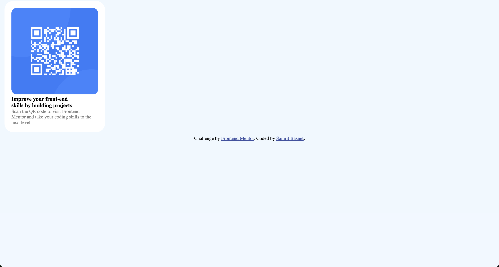

# Frontend Mentor - QR code component solution

This is a solution to the [QR code component challenge on Frontend Mentor](https://www.frontendmentor.io/challenges/qr-code-component-iux_sIO_H). Frontend Mentor challenges help you improve your coding skills by building realistic projects.

### Screenshot



### Links

- Solution URL: [Add solution URL here](https://github.com/samritbasnet/qr-code-component)
- Live Site URL: [Add live site URL here](https://vercel.com/samritbasnets-projects/qr-code-component/83V7sBRWh1V5gy3S5JUy8HKALMrg)

## My process

### Built with

- Semantic HTML5 markup
- CSS custom properties
- Flexbox
- CSS Grid

### What I learned

I learned flexbox css styling components and added html naming convention for class for different component like qr code and text and paragraph which helped in styling

body {
display: flex;
flex-direction: column;
justify-content: center;
align-items: center;
min-height: 100vh;
margin: 0;
background-color: hsl(212, 45%, 89%);
font-family: 'Outfit', sans-serif;
} learned about flexbox and setting margin from this code challenge ```
.qrcode {
border-radius: 10px;
max-width: 100%;
height: auto;
margin-bottom: 20px;
}also added border radius and knew how to do it.

### Continued development

I want to hone my css skills and semantic tags even further so that it would help me in being good frontend developer

**Note: Delete this note and the content within this section and replace with your own plans for continued development.**

### Useful resources

- [Example resource 1](https://www.w3schools.com) - This helped me for beacuse of simpleness of website for beginner. I really liked this pattern and will use it going forward.
- [Example resource 2](https://www.https://htmlcheatsheet.com/css/.com) - This is an amazing website which provide cheatsheet for html and css help me to select particular feature i want to add to my project through cheatcodees.

## Author

- Frontend Mentor - [@yourusername](https://www.frontendmentor.io/profile/samritbasnet)
- Twitter - [@yourusername](https://www.twitter.com/samritbasnet70)

## Acknowledgments

I Suggest everyone to carrying on this process u will make lots of mistake and dont know what you are doing but its normal just keep your head high and search online and u have different ai tools nowadays to help you.So you got this and we have long way to learn but its not destination but process you should enjoy and keep building cool stuff.

```

```
